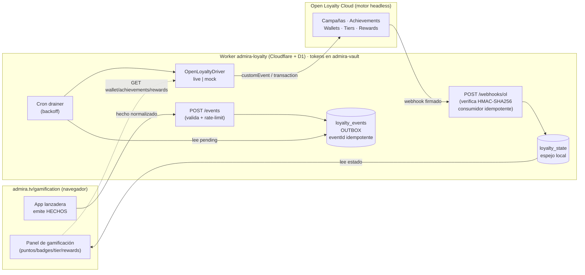

# ADR-001 · Open Loyalty como motor headless de Gamificación (admira.tv)

- **Status:** Accepted
- **Date:** 2026-07-08
- **Decisores:** Carlos Silva (CEO) · equipo AdmiraNeXT
- **Componente:** `workers/admira-loyalty` (Cloudflare Worker + D1) — extensión aditiva del Club Xtanco existente
- **Referencia técnica:** [`RESEARCH-openloyalty.md`](./RESEARCH-openloyalty.md) (chuleta de la API de Open Loyalty **Cloud**, investigada el 2026-07-08). Toda afirmación sobre la API de OL de este ADR está respaldada ahí; no se re-investiga.

---

## Context

Gamificación es un pilar de la lanzadera Admira XP (admira.tv/gamification): check-ins por WiFi/QR, misiones,
colas, reservas, experiencias AR y acciones del asistente deben premiarse con puntos, badges, tiers y
recompensas. Construir y mantener el motor de reglas (wallets, campañas, achievements, expiraciones,
leaderboards) es un producto en sí mismo.

**Open Loyalty** es un *loyalty engine* headless comercial (producto Cloud actual) que ya resuelve ese motor:
custom events + campañas, achievements/badges, tiers, wallets multi-unit, rewards/coupons y webhooks firmados.
La decisión es **no reinventarlo** y usar OL como motor externo, manteniendo Admira dueña de toda la UX.

Partimos de un activo existente: el Worker **`admira-loyalty`** (Club Xtanco) ya en producción, con D1
(`customers`, `visits`, `config`, `admin_log`), API de miembro (`/register`, `/me`, `/checkin`, `/visit`,
`/shop/visit`, `/active`) y capa `/admin/*` (backoffice con Bearer token). El puente se construye **encima**,
sin tocar lo que ya funciona.

Restricciones de la investigación que condicionan el diseño (ver RESEARCH §2, §7, §8, §9):
- OL **no tiene miembro anónimo nativo** → hay que mapear el visitante anónimo a un identificador de OL.
- OL **no documenta idempotency-keys** en escrituras ni **política de reintentos** de webhooks → el puente
  debe garantizar idempotencia por su cuenta, en ambos sentidos.
- **No tenemos tenant de OL todavía** (no hay self-service; el entorno *Staging* se pide por *book-a-demo*) →
  hay que poder desarrollar y validar el circuito E2E **hoy**, sin tenant.

---

## Decision

Adoptamos **Open Loyalty como motor headless externo** de gamificación/loyalty, integrado mediante un
**servicio puente** (el Worker `admira-loyalty` extendido). Puntos de la decisión:

1. **Regla de oro — separación de responsabilidades.**
   OL **decide** puntos, badges, tiers y recompensas (vía sus campañas/achievements). Admira **solo emite
   HECHOS normalizados** ("ocurrió un check-in en la pantalla X") y **refleja** los resultados que OL
   devuelve. Admira nunca calcula puntos ni duplica reglas de negocio.

2. **UX 100% Admira, cero iframe.**
   La experiencia vive en `admira.tv/gamification` con diseño y marca propios. **No se empotra el admin de OL**
   ni ninguna UI de OL. OL es invisible para el usuario final.

3. **El navegador nunca escribe a OL.** Todo pasa por el puente:
   - La app envía cada hecho al puente → se persiste en una **tabla-outbox `loyalty_events`**
     (`eventId` único, `type`, `subjectId`, `sourceApp`, `metadata`, `occurredAt`, `sentAt`,
     `openLoyaltyStatus`). El `eventId` da **idempotencia + auditoría**.
   - Un **cron** drena la outbox hacia OL (custom event / transaction) con backoff, marcando `sentAt` y
     `openLoyaltyStatus` (`pending` → `sent` / `failed`).
   - Los tokens de OL viven **solo en servidor** (bóveda `admira-vault`), nunca en el cliente.

4. **Identidad.**
   - `memberId` = **visitante anónimo estable** (cookie/session de WiFi/QR) mapeado a
     **`loyaltyCardNumber`** en OL (workaround del RESEARCH §2: crear member con
     `identificationMethod=loyaltyCardNumber`, sin email/phone).
   - `accountId`/`clientId` cuando exista cliente B2B → modelado como `label`/`customField` del member
     (RESEARCH §2, laguna 3).
   - `locationId` / `screenId` / `campaignId` viajan **SIEMPRE en `metadata`** del evento (y como `labels`
     en OL para poder segmentar y simular rankings).

5. **Webhooks OL → Admira (fuente de verdad de resultados).**
   El puente se suscribe a los webhooks de OL (`POST /webhook/subscription`) para sincronizar
   **puntos, tiers, recompensas, redenciones y expiraciones**. Verifica la firma **HMAC-SHA256**
   (`X-Webhook-Signature` + `X-Webhook-Timestamp` con ventana < 5 min, quitando el prefijo `whsec_`,
   comparación en tiempo constante — RESEARCH §7). **Nunca se confía en el estado del cliente.**
   Como OL **no documenta reintentos/idempotencia de webhooks** (RESEARCH §7, laguna 5), el consumidor es
   **idempotente por su cuenta** (dedupe por `X-Webhook-Request-Id` + tipo de evento; asumir *at-least-once*).
   Los resultados se guardan en un **espejo local** (`loyalty_state` / `loyalty_webhooks`) que alimenta el
   panel `/gamification`.

6. **Seguridad.**
   Tokens de OL solo en servidor/bóveda; idempotencia por `eventId`; **rate-limit por visitor/screen** en el
   puente (RESEARCH §8: techo 50 req/s en Staging → cola + backoff); **PII mínima** (visitante anónimo,
   sin email salvo B2B); **opt-out GDPR** propagado a OL (`CustomerDeactivated`/anonimización).

7. **Driver OL con modos `live | mock` tras una interfaz.**
   Como aún no hay tenant, el acceso a OL se abstrae tras una interfaz (`OpenLoyaltyDriver` con
   `createMember`, `emitEvent`, `emitTransaction`, `getWallet`, `getAchievements`, `buyReward`,
   `getLeaderboard`, …). El **mock** replica los *shapes* JSON reales del RESEARCH para validar el circuito
   E2E hoy; se conmuta a **live** por secrets (`OL_BASE_URL`, `OL_STORE_CODE`, `OL_TOKEN`, `OL_WEBHOOK_SECRET`)
   cuando llegue el Staging. La base URL es configurable, nunca hardcodeada (RESEARCH §9, laguna 1).

### Diagrama de flujo



Flujo textual (fallback ASCII):

```
[App] --hecho--> [POST /events] --> [OUTBOX loyalty_events] --cron--> [Driver live|mock] --> [Open Loyalty]
                                                                                                    |
[Panel /gamification] <-- [espejo loyalty_state] <-- [POST /webhooks/ol (HMAC + idempotente)] <-----+
```

---

## Consequences

### Positivas
- **Time-to-market:** el motor de reglas ya existe; el equipo solo construye puente + UX. Semanas, no meses.
- **UX propia sin ataduras:** marca Admira intacta; OL invisible; se puede cambiar de motor detrás del driver.
- **Auditoría e idempotencia de primera clase:** la outbox con `eventId` da trazabilidad completa y evita
  doble conteo aunque la app reintente.
- **Aditivo y de bajo riesgo:** no toca el Club Xtanco en producción (tablas y API intactas); nuevas tablas
  y rutas conviven con las actuales.
- **Desarrollo sin tenant:** el modo `mock` desbloquea el E2E hoy y se conmuta a real por secrets.
- **Estado siempre consistente:** el panel lee el espejo alimentado por webhooks, nunca estado cliente.

### Negativas / costes
- **Dependencia de proveedor** (lock-in parcial) mitigada por el driver, pero real: contrato, precios y SLA de OL.
- **Consistencia eventual:** el usuario ve el premio tras el ciclo outbox→cron→OL→webhook, no instantáneo.
  Leaderboards de OL recalculan cada 4 h (RESEARCH §6).
- **Complejidad operativa nueva:** cron, outbox, verificación HMAC, dedupe de webhooks y un espejo que mantener.
- **Bloqueo por tenant:** el `live` no se valida de verdad hasta tener Staging (vía *book-a-demo*).

### Riesgos (top)
1. **Miembro anónimo no nativo (RESEARCH §2, laguna 2).** El mapeo `loyaltyCardNumber = visitorId` es un
   workaround: hay que **confirmar en Staging** que OL permite crear members sin email/phone con
   `identificationMethod=loyaltyCardNumber`. Si no, plan B = `customFieldsData`/`labels` + búsqueda por filtro.
2. **Webhooks sin garantías documentadas (RESEARCH §7, lagunas 5, 9, 10).** Sin política de reintentos, sin
   shape exacto por evento y con el nombre literal del request-id sin confirmar. Mitigación: **consumidor
   idempotente** por request-id+tipo, asumir *at-least-once*, y fijar los DTOs contra payloads reales de Staging.
3. **Leaderboards sin endpoint de lectura por API (RESEARCH §6, laguna 4).** El ranking semanal por
   `locationId` del MVP **no** tiene endpoint nativo → se implementa como *query* de members ordenados por
   puntos + filtro por `label location;<id>`, encapsulado tras `getLeaderboard()`. Riesgo de que la simulación
   no case 1:1 con el leaderboard nativo de OL.

*(Riesgos secundarios: rate-limit 50 req/s en Staging → cola/backoff; sin idempotency-key nativa → dedupe por
`eventId`/`documentNumber`; TTL del JWT 24 h → preferir X-AUTH-TOKEN permanente.)*

---

## Alternatives considered

1. **Motor de loyalty propio (rechazada).** Reimplementar wallets, campañas, tiers, achievements,
   expiraciones y leaderboards = meses de desarrollo y mantenimiento indefinido de un producto que ya existe
   comercialmente. No aporta diferenciación; distrae del core (la UX y la lanzadera).

2. **Repos open-source legacy de OL como base (rechazada).** El *Open Source Edition* (Symfony v3.2) es
   **solo testing no comercial, sin garantías** y **no equivale al Cloud actual** (endpoints y paradigma CQRS
   distintos — RESEARCH §Fuentes, §9). Directriz de Carlos: **referencia histórica, nunca base de producción.**

3. **Iframe del admin de OL (rechazada explícitamente).** Rompe la marca Admira, expone UI de terceros y
   acopla la UX al panel de OL. Contradice la regla de "UX 100% Admira".

4. **El navegador escribe directo a OL (rechazada).** Expondría tokens de OL en el cliente, sin idempotencia,
   sin rate-limit propio, sin auditoría y sin poder normalizar hechos. Inseguro e infragestionable.

**Decisión:** OL headless externo + puente con outbox + webhooks firmados + driver `live|mock`, según arriba.
